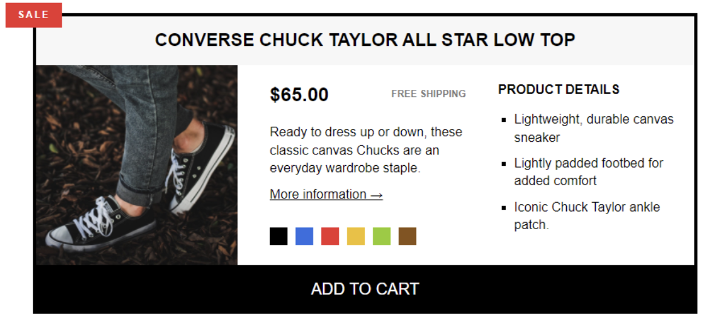
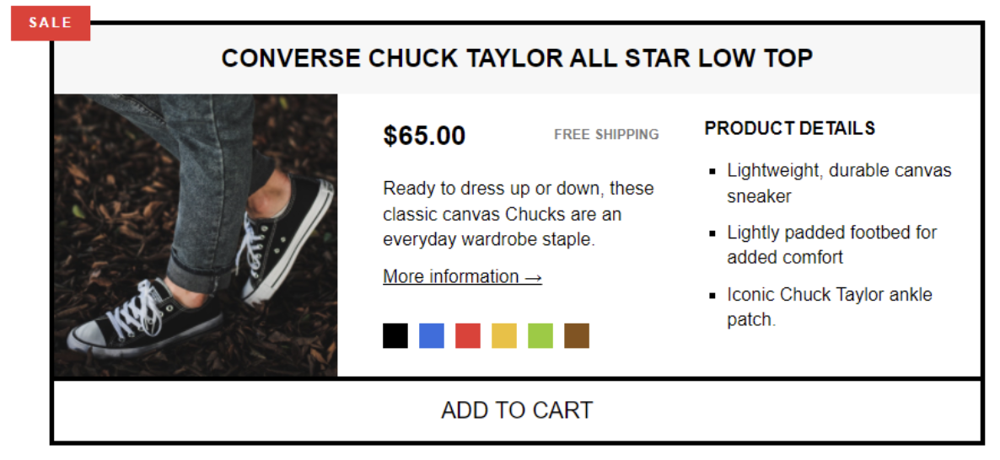
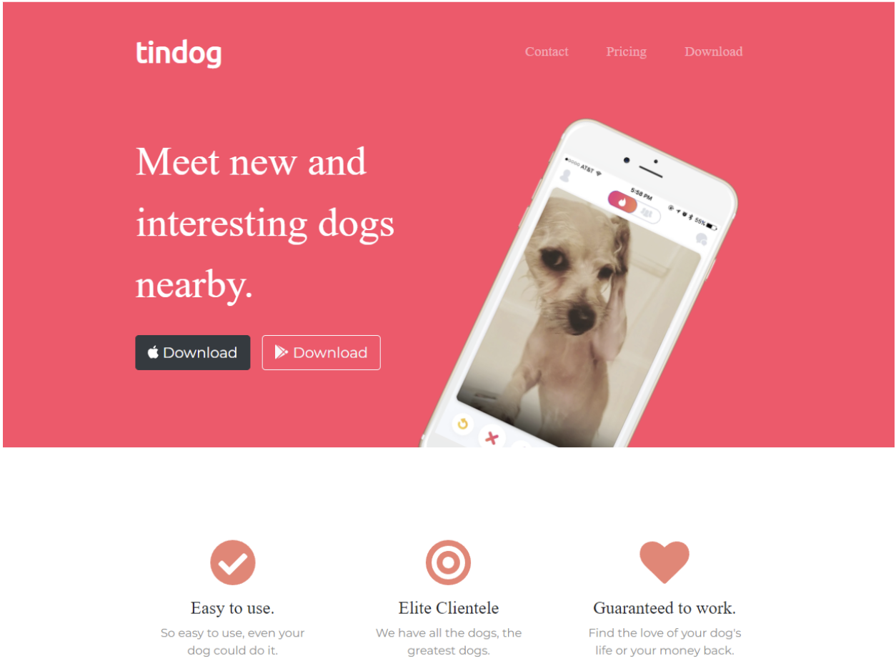
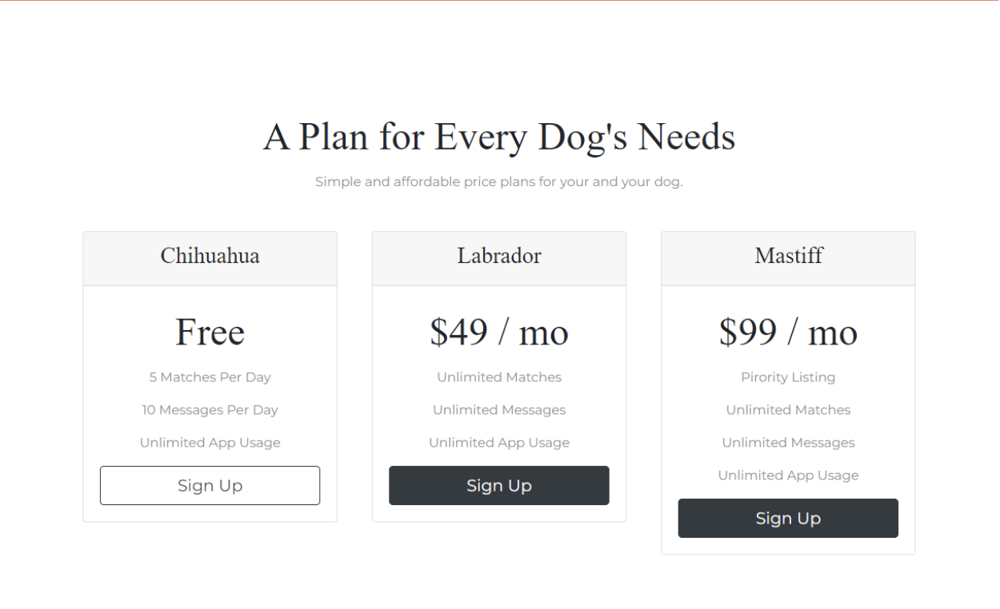

# Front End Web Programming Assignment [Winter-2025]
420-931-VA - Front End Web Programming Assignment (Winter 2025) 

This template repository is the starter project for Front-end Programming Assignment. Written in HTML, CSS (and JavaScript).

### Question(s)

1. **(10%)** Create the following page using HTML5 and CSS. It should have all the details shown in the following screenshots:

When you hover on “ADD TO CART”, the mouse cursor changes to a pointer, and the background color of the button changes as well:

1. **(20%)** Create the following page using HTML5, CSS, and Bootstrap.

Please find the attached folder for the images used in the project. It should be responsive and have all the details shown in the following screenshots:

